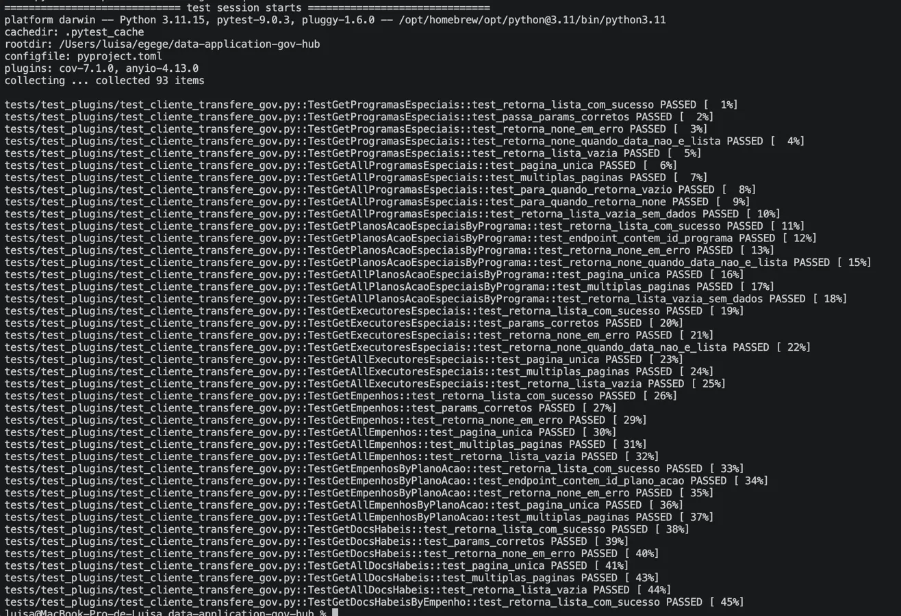
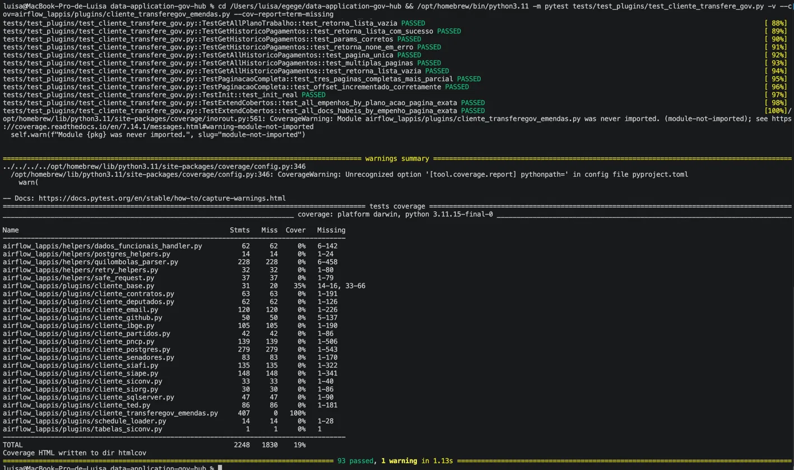
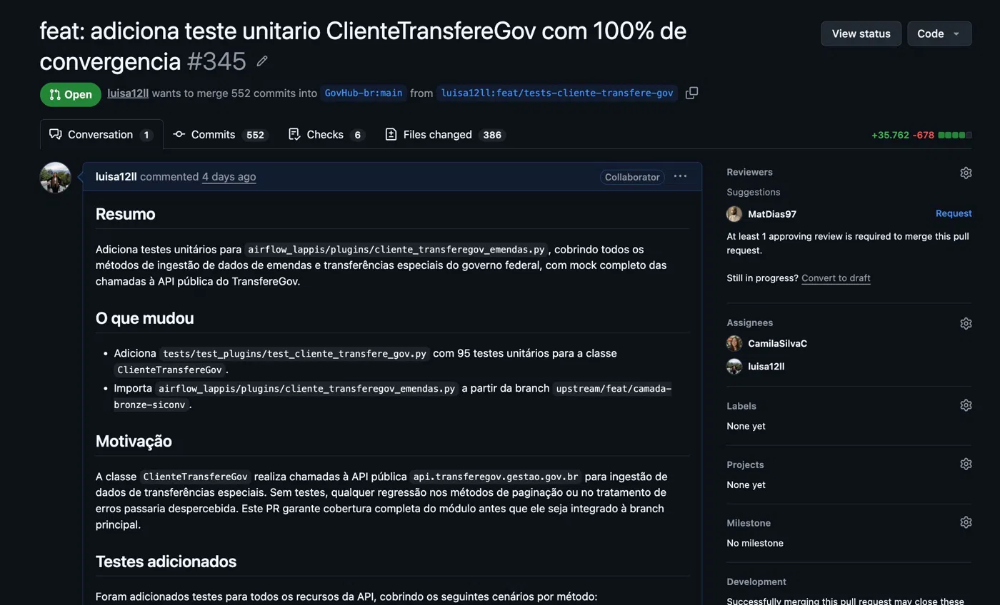

# Diário de Bordo – Camila Silva Cavalcante

**Disciplina:** Gerência de Configuração e Evolução de Software (GCES)

**Equipe:** Gov Hub BR

**Comunidade/Projeto de Software Livre:** Gov Hub BR

---

## Sprint 0 – [06/04/2026 – 20/04/2026]

### Resumo da Sprint

Durante esta sprint, que foi focada na organização do grupo e familiarização com o projeto. Realizei a criação do fork, estudei a documentação técnica e políticas de contribuição do projeto. Fiz a configuração completa do ambiente de desenvolvimento do projeto, incluindo a instalação e ajuste de ferramentas.

Durante esta sprint, que foi focada na organização do grupo e familiarização com o projeto. Realizei a criação do fork, estudei a documentação técnica e políticas de contribuição do projeto. Fiz a configuração completa do ambiente de desenvolvimento do projeto, incluindo a instalação e ajuste de ferramentas.

### Atividades Realizadas

| Data  | Atividade | Tipo  | Link/Referência | Status |

| Data  | Atividade | Tipo  | Link/Referência | Status |
| ----- | --------- | --------------------------------- | --------------- | ------ |
| 15/04 | Leitura e estudo da documentação do projeto | Estudo | [Documentação](https://gov-hub.io/govhub/sobre-projeto/overview/) | Concluído |
| 18/04 | Mapeamento das políticas de contribuição | Estudo | [Guia de Contribuição](https://github.com/GovHub-br/gov-hub?tab=contributing-ov-file) | Concluído |
| 19/04 | Leitura do E-book | Estudo | [E-book](https://gov-hub.io/govhub/ebook-viewer/) | Concluído |
| 19/04 | Fork do repositório | Código | [Fork](https://github.com/CamilaSilvaC/gov-hub) | Concluído |
| 19/04 | Configuração do ambiente | Código | [Guia de Instalação](https://gov-hub.io/govhub/documentacao/instalacao/) | Concluído |

### Detalhamento das Atividades Realizadas

Para garantir que o ambiente estava bem configurado e que o projeto GovHub funcionava corretamente, foram feitos testes práticos utilizando todos os componentes da arquitetura (Docker, Airflow, PostgreSQL, dbt e Superset). A seguir, estão descritas as principais etapas realizadas:

<details>
<summary><span style="font-size: 1.25em; font-weight: bold; cursor: pointer;">1. Execução do ambiente via Docker</span></summary>

Print da tela mostrando os containers do Docker.


<p align="center"><i><b>Fonte:</b> Camila Silva Cavalcante</i></p>
</details>

<details>
<summary><span style="font-size: 1.25em; font-weight: bold; cursor: pointer;">2. Ingestão de dados com Airflow</span></summary>
Painel do Airflow mostrando as DAGs e a DAG api_contratos_dag executada.


<p align="center"><i><b>Fonte:</b> Camila Silva Cavalcante</i></p>
</details>

<details>
<summary><span style="font-size: 1.25em; font-weight: bold; cursor: pointer;">3. Superset — Conexão com Banco e Exploração Inicial</span></summary>
Painel do Superset com a conexão com o banco PostgreSQL local configurada.


<p align="center"><i><b>Fonte:</b> Camila Silva Cavalcante</i></p>
</details>

<details>
<summary><span style="font-size: 1.25em; font-weight: bold; cursor: pointer;">4. Configuração e Validação do DBT</span></summary>
O comando dbt debug foi executado com sucesso, validando os arquivos de configuração (profiles.yml e dbt_project.yml) e a conexão com o banco PostgreSQL.


<p align="center"><i><b>Fonte:</b> Camila Silva Cavalcante</i></p>
</details>

<details>
<summary><span style="font-size: 1.25em; font-weight: bold; cursor: pointer;">5. Consultas no banco de dados</span></summary>
Mostra os resultados das consultas SQL executadas para validar e explorar os dados da tabela contratos.contratos.


<p align="center"><i><b>Fonte:</b> Camila Silva Cavalcante</i></p>
</details>

### Maiores Avanços

* Consegui configurar completamente um ambiente complexo utilizando Docker + WSL.
* Entendi melhor a organização do repositório.
* Entendimento prático do funcionamento do Airflow, PostgreSQL e dbt.

### Maiores Dificuldades

* Dificuldade ao configurar o ambiente por falta de dependências.
* Incompatibilidade de versão do Python (3.12 vs 3.11 exigido pelo projeto).


### Aprendizados


* Fluxo de contribuição do projeto.
* Como configurar ambientes de desenvolvimento usando Docker e WSL.
* Funcionamento básico do Airflow (DAGs, Variables, Connections).
* Percebi melhor como seguir o passo a passo da documentação ajuda a evitar erros na configuração.

### Plano Pessoal para a Próxima Sprint

* [ ] Analisar as issues e encontrar uma para contribuir.
* [ ] Atuar em conjunto com a **Luísa Ferreira** para o diagnóstico e resolução de problemas técnicos identificados na nossa issue.
* [ ] Analisar as issues e encontrar uma para contribuir.

## Sprint 1 – [21/04/2026 – 11/05/2026]

### Resumo da Sprint

Nesta sprint, trabalhei em conjunto com a Luisa no desenvolvimento do pipeline de extração dos dados de Unidades de Conservação do Censo 2022. Participei da análise das fontes de dados, desenvolvimento das tasks no Airflow, validação dos dados no PostgreSQL e testes de integração com o Superset. Todo o escopo foi implementado com sucesso.

### Atividades Realizadas

| Data | Atividade | Tipo | Link/Referência | Status |
| :--- | :--- | :--- | :--- | :--- |
| 30/04 | Análise das estruturas de dados do IBGE | Estudo | [FTP IBGE](https://ftp.ibge.gov.br/Censos/Censo_Demografico_2022/Unidades_de_Conservacao/) | Concluído |
| 03/05 | Colaboração no desenvolvimento da DAG | Código | Airflow | Concluído |
| 06/05 | Implementação da task de extração | Código | `extrair_dados_excel` | Concluído |
| 06/05 | Validação do armazenamento no PostgreSQL | Validação | Schema `censo_demografico` | Concluído |
| 07/05 | Testes de qualidade dos dados | Teste | Consultas SQL | Concluído |
| 08/05 | Validação das 19 tabelas criadas | Validação | Padrão `UN_CONS_*` | Concluído |
| 08/05 | Testes de acesso via Superset | Teste | SQL Lab | Concluído |

### Detalhamento das Atividades Realizadas

Para validar a implementação do pipeline, realizamos testes em cada etapa:

<details>
<summary><span style="font-size: 1.25em; font-weight: bold; cursor: pointer;">1. Execução da DAG de Extração</span></summary>

Print do Airflow mostrando a DAG `ingestao_ibge_unidades_conservacao_dag` em execução com sucesso, com as 3 tasks: listar_arquivos_ftp, extrair_dados_excel e limpar_e_inserir_dados.


<p align="center"><i><b>Fonte:</b> Camila Silva Cavalcante</i></p>
</details>

<details>
<summary><span style="font-size: 1.25em; font-weight: bold; cursor: pointer;">2. Validação das Tabelas Criadas</span></summary>

Query SQL mostrando a listagem das 19 tabelas criadas no schema `censo_demografico` com o padrão de nomenclatura `UN_CONS_*`.


<p align="center"><i><b>Fonte:</b> Camila Silva Cavalcante</i></p>
</details>

<details>
<summary><span style="font-size: 1.25em; font-weight: bold; cursor: pointer;">3. Verificação dos Dados no Superset</span></summary>

Consulta aos dados no Superset mostrando os dados demográficos de Unidades de Conservação extraídos e prontos para visualização.


<p align="center"><i><b>Fonte:</b> Camila Silva Cavalcante</i></p>
</details>

### Maiores Avanços

* Compreensão profunda da arquitetura de extração do GovHub;
* Sucesso na implementação colaborativa do pipeline;
* Validação bem-sucedida de todos os critérios de aceitação;
* Experiência com tratamento de dados governamentais;
* Domínio das ferramentas da stack de dados (Airflow, PostgreSQL, Superset).

### Maiores Dificuldades

* Compreensão inicial da estrutura complexa de dimensões dos arquivos;
* Tratamento de inconsistências nos formatos de dados;
* Otimização das queries para grandes volumes de dados.

### Aprendizados

* Desenvolvimento de DAGs complexas no Airflow;
* Técnicas de validação de dados em pipelines;
* Importância de testar cada etapa independentemente;
* Padrões de nomenclatura em projetos de dados;
* Colaboração efetiva em desenvolvimento em pares.

### Plano Pessoal para a Próxima Sprint

* [ ] Participar da revisão de código do Pull Request.
* [ ] Contribuir com sugestões de melhoria.
* [ ] Documentar o pipeline no repositório.
* [ ] Trabalhar na integração final com Luisa.

## Sprint 2 – [12/05/2026 – 26/05/2026]

### Resumo da Sprint

Esta sprint teve como foco a implementação de testes unitários para o módulo `cliente_transferegov_emendas.py`, responsável pelo consumo de dados de emendas parlamentares e transferências especiais do governo federal. Realizei essa atividade juntamente com a **Luísa Ferreira**, envolvendo a criação dos testes, a configuração de mocks para as requisições à API pública do TransfereGov e a solução de problemas relacionados ao ambiente de desenvolvimento. Como resultado, foi alcançada cobertura de 100% das linhas do módulo analisado.

### Atividades Realizadas

| Data | Atividade | Tipo | Link |
| :---- | :-------------------------------------------------------------- | :----------- | :----------------------------------------------------------------------------- | :----------------- |
| 12/05 | Estudo e análise da issue #320                                  | Estudo       | [Issue #320](https://github.com/GovHub-br/data-application-gov-hub/issues/320) | Concluído          |
| 14/05 | Análise do código de `cliente_transferegov_emendas.py`          | Estudo       | `airflow_lappis/plugins/cliente_transferegov_emendas.py`                       | Concluído          |
| 18/05 | Configuração do ambiente de testes (Python 3.11 e dependências) | Ambiente     | `pyproject.toml`                                                               | Concluído          |
| 18/05 | Desenvolvimento dos testes unitários com mock da API            | Código       | `tests/test_plugins/test_cliente_transfere_gov.py`                             | Concluído          |
| 22/05 | Sincronização do fork com o repositório upstream                | Código       | Branch `feat/tests-cliente-transfere-gov`                                      | Concluído          |
| 25/06 | Atualização do Diário de Bordo                                  | Documentação | -                                                                              | Concluído          |
| 07/06 | Abertura do Pull Request                                        | Código       | [PR #345](https://github.com/GovHub-br/data-application-gov-hub/pull/345)      | Aguardando revisão |

### Detalhamento das Atividades Realizadas

<details>
<summary><span style="font-size: 1.25em; font-weight: bold; cursor: pointer;">1. Análise da Issue e do Módulo</span></summary>

Foi realizado o estudo da [issue #320](https://github.com/GovHub-br/data-application-gov-hub/issues/320) e a leitura detalhada do módulo `cliente_transferegov_emendas.py`, identificando todos os métodos da classe `ClienteTransfereGov` e mapeando os principais cenários de teste, incluindo casos de sucesso, falhas HTTP, paginação automática e atualização de offset.

</details>

<details>
<summary><span style="font-size: 1.25em; font-weight: bold; cursor: pointer;">2. Configuração do Ambiente de Testes</span></summary>

O projeto requer Python 3.11 devido ao uso de recursos introduzidos nas versões mais recentes da linguagem, porém o `pytest` estava sendo executado utilizando o Python 3.9 instalado no sistema. Para resolver o problema, foi utilizado o interpretador Python 3.11 disponibilizado pelo Homebrew (`/opt/homebrew/bin/python3.11`), além da instalação das dependências necessárias (`pytest`, `pytest-cov`, `httpx` e `pandas`) nesse ambiente.

</details>

<details>
<summary><span style="font-size: 1.25em; font-weight: bold; cursor: pointer;">3. Implementação dos Testes Unitários</span></summary>

Foram desenvolvidos 95 testes unitários organizados em classes de acordo com cada recurso disponibilizado pela API. O método `request`, herdado da classe `ClienteBase`, foi substituído por um `MagicMock` diretamente na instância, garantindo que nenhuma requisição real fosse enviada para a API do governo federal.

Os dados simulados reproduzem a estrutura real das respostas retornadas pela API, utilizando listas de dicionários contendo os campos esperados em cada endpoint.

Recursos cobertos:

* Programas especiais;
* Planos de ação especiais por programa;
* Executores especiais;
* Empenhos especiais (geral e por plano de ação);
* Documentos hábeis especiais (geral e por empenho);
* Metas especiais;
* Finalidades especiais;
* Ordens bancárias especiais;
* Relatórios de gestão especial e novo;
* Planos de trabalho especiais;
* Histórico de pagamentos especiais.

Execução dos testes - início da suíte:



<p align="center"><i><b>Fonte:</b> Luísa de Souza Ferreira</i></p>

</details>

<details>
<summary><span style="font-size: 1.25em; font-weight: bold; cursor: pointer;">4. Resultado da Cobertura</span></summary>

A execução do `pytest` utilizando a opção `--cov` confirmou cobertura total do módulo analisado:

```text
airflow_lappis/plugins/cliente_transferegov_emendas.py    407      0   100%
```

Foram contabilizados 93 testes executados com sucesso e nenhuma falha registrada.



<p align="center"><i><b>Fonte:</b> Luísa de Souza Ferreira</i></p>

</details>

<details>
<summary><span style="font-size: 1.25em; font-weight: bold; cursor: pointer;">5. Pull Request Aberto</span></summary>

O Pull Request [#345](https://github.com/GovHub-br/data-application-gov-hub/pull/345) foi aberto na branch `feat/tests-cliente-transfere-gov` e permanece aguardando revisão.



<p align="center"><i><b>Fonte:</b> Luísa de Souza Ferreira</i></p>

</details>

### Maiores Avanços

* Desenvolvimento de 95 testes unitários cobrindo todos os métodos da classe `ClienteTransfereGov`;
* Mock completo das requisições à API pública do TransfereGov, eliminando dependência de rede durante os testes;
* Cobertura de 100% das linhas do módulo `cliente_transferegov_emendas.py`;
* Correção dos problemas relacionados à versão do Python no ambiente local;
* Trabalho colaborativo realizado com Luísa Ferreira.

### Maiores Dificuldades

* Incompatibilidade entre versões do Python: o ambiente utilizava Python 3.9, enquanto o projeto exige Python 3.11, ocasionando erros (`TypeError`) durante a coleta dos testes.

### Aprendizados

* Criação de testes unitários utilizando `unittest.mock` para clientes HTTP;
* Utilização de `MagicMock` e `side_effect` para simular paginação automática;
* Configuração de múltiplas versões do Python via Homebrew no macOS;
* Uso do `pytest-cov` para análise de cobertura de testes;
* Processo de sincronização de forks com repositórios upstream no Git.

### Plano Pessoal para a Próxima Sprint

* [ ] Acompanhar a revisão e aprovação do PR #345.
* [ ] Implementar melhorias sugeridas durante o processo de revisão.
* [ ] Selecionar a próxima issue juntamente com Luísa Ferreira.

## Sprint 3 – [27/05/2026 – 10/06/2026]

### Resumo da Sprint

Esta sprint foi voltada para a criação e aplicação de testes estruturais e de negócio nos schemas dbt do sistema `ipea/contratos_dbt`, abrangendo todas as camadas disponíveis (bronze, silver, gold e views). Em conjunto com **Luísa**, trabalhei na definição dos testes de chaves primárias e na validação dos campos de identificação de contratos e datas de vigência. A entrega contempla todos os modelos do sistema de contratos do IPEA.

### Atividades Realizadas

| Data | Atividade | Tipo | Link/Referência | Status |
| :--- | :--- | :--- | :--- | :--- |
| 27/05 | Estudo e análise da issue #302 | Estudo | [Issue #302](https://github.com/GovHub-br/data-application-gov-hub/issues/302) | Concluído |
| 28/05 | Leitura e mapeamento dos schemas existentes (bronze, silver, gold, views) | Estudo | `airflow_lappis/dags/dbt/ipea/models/contratos_dbt/` | Concluído |
| 29/05 | Análise das macros de qualidade disponíveis no projeto | Estudo | `airflow_lappis/dags/dbt/ipea/macros/data_quality/` | Concluído |
| 02/06 | Implementação dos testes de chave primária no bronze | Código | `contratos_dbt/bronze/schema.yml` | Concluído |
| 03/06 | Implementação dos testes de chave primária no silver | Código | `contratos_dbt/silver/schema.yml` | Concluído |
| 04/06 | Implementação dos testes de chave primária no gold | Código | `contratos_dbt/gold/schema.yml` | Concluído |
| 04/06 | Implementação dos testes de chave primária nas views | Código | `contratos_dbt/views/schema.yml` | Concluído |
| 09/06 | Abertura do Pull Request | Código | [PR #384](https://github.com/GovHub-br/data-application-gov-hub/pull/384) | Aguardando revisão |
| 10/06 | Atualização do Diário de Bordo | Documentação | - | Concluído |

### Detalhamento das Atividades Realizadas

<details>
<summary><span style="font-size: 1.25em; font-weight: bold; cursor: pointer;">1. Análise da Issue e dos Schemas</span></summary>

Leitura da [issue #302](https://github.com/GovHub-br/data-application-gov-hub/issues/302) e levantamento completo dos schemas de todas as camadas do sistema `contratos_dbt`. Foi feito um mapeamento de todos os modelos, com identificação dos campos de chave primária, campos de identificação (CNPJ/CPF) e datas de vigência em cada tabela.

</details>

<details>
<summary><span style="font-size: 1.25em; font-weight: bold; cursor: pointer;">2. Análise das Macros de Qualidade</span></summary>

Leitura das macros `test_verificacao_tipagem` e `test_row_count_match` disponíveis em `airflow_lappis/dags/dbt/ipea/macros/data_quality/`, com o objetivo de compreender o padrão já estabelecido no projeto para testes de tipagem e contagem de registros, e verificar como os testes nativos do dbt (`unique`, `not_null`) poderiam complementar os requisitos da issue.

</details>

<details>
<summary><span style="font-size: 1.25em; font-weight: bold; cursor: pointer;">3. Implementação dos Testes</span></summary>

Inseridos testes `unique` + `not_null` nos campos de chave primária e `not_null` nos campos de identificação e datas de vigência em todas as camadas:

**Bronze** (`contratos`, `cronogramas`, `faturas`, `empenhos`):
- `unique` + `not_null` nos campos `id`
- `not_null` em `contrato_id`, `fornecedor_cnpj_cpf_idgener`, `vigencia_inicio` e `vigencia_fim`

**Silver** (`contratos_empenhos`, `contratos_estagios`, `contratos_faturas`, `cronogramas_faturas_mensal`):
- `unique` + `not_null` no campo `id` de `contratos_faturas`
- `not_null` em `contrato_id`, `fornecedor_cnpj_cpf_idgener`, `vigencia_inicio` e `vigencia_fim`

**Gold** (`contratos_resumo`, `contratos_somatorio`, `contratos_comparativo_mensal`):
- `unique` + `not_null` em `contrato_id` de `contratos_resumo` e `contratos_somatorio`
- `not_null` em `fornecedor_cnpj_cpf`, `vigencia_inicio` e `vigencia_fim`

**Views** (`identificadores`):
- `unique` + `not_null` em `contrato_id`
- `not_null` em `cnpj_cpf`

</details>

### Maiores Avanços

- Cobertura completa das 4 camadas do sistema com testes de chave primária (`unique` + `not_null`);
- Validação de campos de identificação (CNPJ/CPF) e datas de vigência em todos os modelos;
- Entrega abrangendo todas as camadas do sistema `contratos_dbt`: bronze, silver, gold e views;
- Trabalho colaborativo com Luísa ao longo da sprint.

### Maiores Dificuldades

- Determinar com precisão quais campos exercem o papel de chave primária em cada camada — em modelos como `contratos_comparativo_mensal`, o `contrato_id` se repete por mês, o que exigiu uma análise mais criteriosa antes de aplicar o teste `unique`.

### Aprendizados

- Estrutura e padrões de testes dbt (`unique`, `not_null`) em projetos reais;
- Distinção entre chaves primárias e chaves estrangeiras no contexto de schemas dbt;
- Análise de modelos de dados distribuídos em múltiplas camadas (bronze, silver, gold, views);
- Leitura e interpretação de macros customizadas de qualidade de dados;
- Fluxo de contribuição com sincronização de fork e abertura de PR.

### Plano Pessoal para a Próxima Sprint

- [ ] Acompanhar a revisão e aprovação do PR de contratos_dbt.
- [ ] Implementar sugestões de melhoria apontadas na revisão.
- [ ] Escolher a próxima issue com a Luísa.

## Sprint 4 – [11/06/2026 – 01/07/2026]

### Resumo da Sprint

Esta sprint foi dedicada à implementação de testes estruturais e de negócio nos schemas dbt do sistema `mcid/conjuntura_dbt`, cobrindo as camadas silver e gold. Em conjunto com **Luísa**, trabalhei no mapeamento das tabelas, identificação das chaves primárias e definição dos testes de unicidade e nulidade. A entrega cobre todos os 39 modelos do sistema conjuntura do MCID, utilizando uma arquitetura de modelos espelho que consome as tabelas já processadas no banco `cidades`.

### Atividades Realizadas

| Data | Atividade | Tipo | Link/Referência | Status |
| :--- | :--- | :--- | :--- | :--- |
| 11/06 | Estudo e análise da issue #295 | Estudo | [Issue #295](https://github.com/GovHub-br/data-application-gov-hub/issues/295) | Concluído |
| 12/06 | Investigação dos repositórios `data-application-gov-hub` e `data-application-cidades` | Estudo | `airflow_lappis/dags/dbt/ipea/models/` | Concluído |
| 13/06 | Mapeamento dos 39 modelos silver e gold e identificação das chaves primárias | Estudo | `data-application-cidades/models/mcid/conjuntura_dbt/` | Concluído |
| 16/06 | Análise do padrão de testes adotado no projeto (referência: `mir/metadata` e `mcid/empreendimento_far_dbt`) | Estudo | `airflow_lappis/dags/dbt/ipea/macros/tests/` | Concluído |
| 18/06 | Criação dos 39 modelos `.sql` espelho em `models/mcid/conjuntura_dbt/` | Código | `contratos_dbt/models/mcid/conjuntura_dbt/` | Concluído |
| 23/06 | Criação da macro `unique_combination_of_columns` para testes de PK composta | Código | `airflow_lappis/dags/dbt/ipea/macros/tests/unique_combination_of_columns.sql` | Concluído |
| 26/06 | Implementação do `schema.yml` com testes `unique` e `not_null` para todos os modelos | Código | `airflow_lappis/dags/dbt/ipea/models/mcid/conjuntura_dbt/schema.yml` | Concluído |
| 29/06 | Atualização do `sources.yml` com os blocos `conjuntura_silver` e `conjuntura_gold` | Código | `airflow_lappis/dags/dbt/ipea/models/sources.yml` | Concluído |
| 30/06 | Atualização do `dbt_project.yml` com a configuração do `mcid/conjuntura_dbt` | Código | `airflow_lappis/dags/dbt/ipea/dbt_project.yml` | Concluído |
| 01/07 | Abertura do Pull Request | Código | [PR #428](https://github.com/GovHub-br/data-application-gov-hub/pull/428) | Aguardando revisão |
| 01/07 | Atualização do Diário de Bordo | Documentação | - | Concluído |

### Detalhamento das Atividades Realizadas

<details>
<summary><span style="font-size: 1.25em; font-weight: bold; cursor: pointer;">1. Análise da Issue e Investigação dos Repositórios</span></summary>

Leitura da [issue #295](https://github.com/GovHub-br/data-application-gov-hub/issues/295) e investigação dos dois repositórios envolvidos: `data-application-gov-hub`, onde os testes seriam implementados, e `data-application-cidades`, onde os modelos `mcid/conjuntura_dbt` já existiam com as transformações silver e gold completas. A investigação revelou que o projeto dbt está localizado em `airflow_lappis/dags/dbt/ipea/` e que o `mcid/conjuntura_dbt` não existia no `gov-hub`, exigindo a criação de modelos espelho.

</details>

<details>
<summary><span style="font-size: 1.25em; font-weight: bold; cursor: pointer;">2. Mapeamento dos Modelos e Identificação das Chaves Primárias</span></summary>

Leitura completa dos 39 modelos `.sql` do `conjuntura_dbt` no repositório `data-application-cidades`, cobrindo 19 modelos silver e 20 modelos gold. Para cada modelo foi identificada a chave primária — simples ou composta — com base na análise das colunas identificadoras, agrupamentos e estrutura das queries. Duas tabelas gold (`gold_indicadores_financiamento_pf` e `gold_precos_construcao`) foram identificadas como singletons, sem chave primária natural, e tratadas de forma diferenciada.

</details>

<details>
<summary><span style="font-size: 1.25em; font-weight: bold; cursor: pointer;">3. Implementação dos Modelos e Testes</span></summary>

Criados 39 modelos `.sql` espelho em `airflow_lappis/dags/dbt/ipea/models/mcid/conjuntura_dbt/`, cada um consumindo as tabelas já processadas no banco `cidades` via `{{ source(...) }}`. Implementado o `schema.yml` cobrindo todos os modelos com:

**Silver** (19 modelos):
- PKs simples: `unique` + `not_null` em colunas como `data_referencia` e `periodo`
- PKs compostas: macro `unique_combination_of_columns` + `not_null` em combinações como `[ano, mes]`, `[ano, trimestre]`, `[tipo, data_referencia]` e `[nome_empresa, ano_balanco, trimestre_balanco]`

**Gold** (20 modelos):
- PKs simples: `unique` + `not_null` em colunas como `periodo`, `regiao`, `indicador` e `ordem`
- PKs compostas: macro `unique_combination_of_columns` + `not_null` em combinações como `[ano, mes, banco]` e `[ano, trimestre]`
- Singletons: apenas `not_null` nas colunas principais, com descrição explicitando a ausência de chave primária natural

</details>

### Maiores Avanços

- Implementação de testes de chave primária (`unique` + `not_null`) em todos os 39 modelos do sistema `conjuntura_dbt`;
- Criação de macro `unique_combination_of_columns` para suporte a PKs compostas sem dependência de pacotes externos;
- Arquitetura de modelos espelho que valida as tabelas do banco `cidades` a partir do `gov-hub`;
- Trabalho colaborativo com Luísa ao longo da sprint.

### Maiores Dificuldades

- Identificar que os modelos `mcid/conjuntura_dbt` não existiam no `gov-hub` e estavam em outro repositório, exigindo investigação prévia antes de qualquer implementação;
- Definir a estratégia correta para tabelas singleton sem chave primária natural, que não se enquadravam nos padrões de `unique` simples ou composto;
- Compreender a arquitetura de dois repositórios e como o `gov-hub` deveria consumir os dados já processados no `cidades` sem reprocessar transformações.

### Aprendizados

- Arquitetura de múltiplos repositórios dbt e estratégia de modelos espelho para validação cruzada;
- Identificação de chaves primárias simples e compostas a partir da análise de modelos SQL reais;
- Criação de macros customizadas de teste dbt sem dependência de pacotes externos;
- Diferença entre tabelas com PK natural e tabelas singleton no contexto de testes de qualidade;
- Fluxo de contribuição em projetos com repositórios interdependentes.

### Plano Pessoal para a Próxima Sprint

- [ ] Acompanhar a revisão e aprovação do PR do `conjuntura_dbt`.
- [ ] Implementar sugestões de melhoria apontadas na revisão.
- [ ] Escolher a próxima issue com a Luísa.