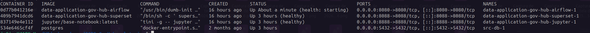
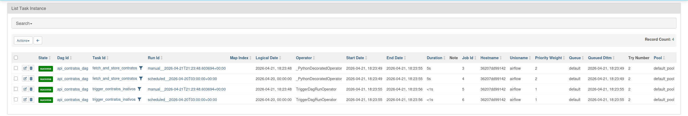
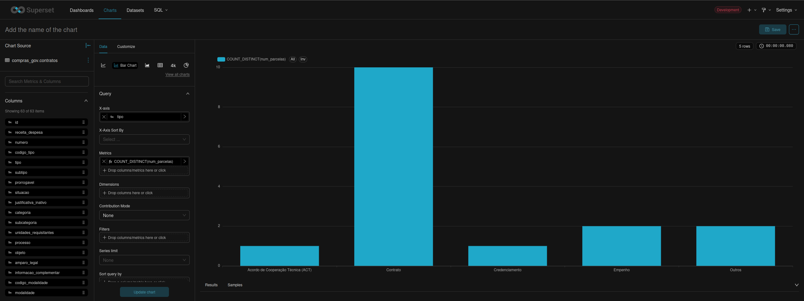
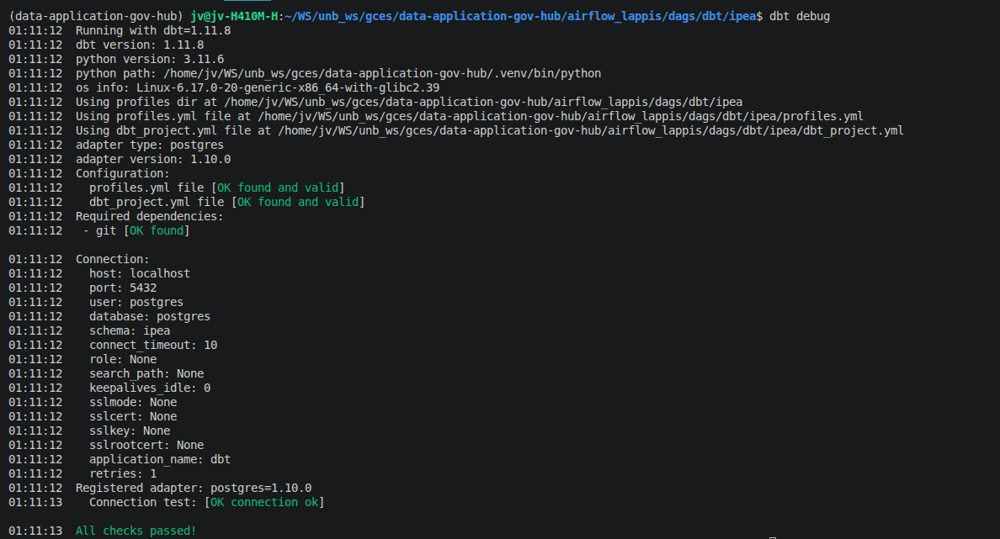
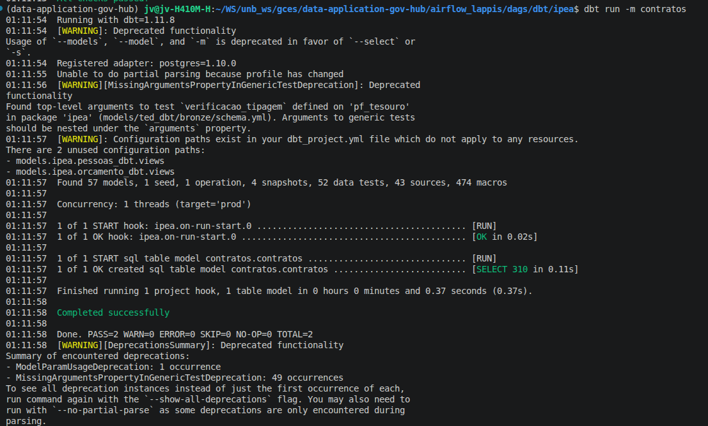
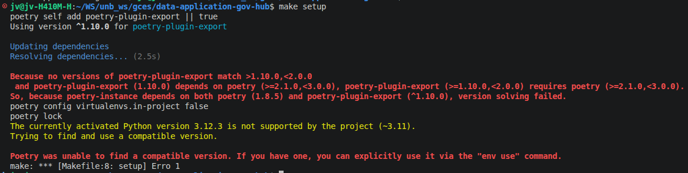
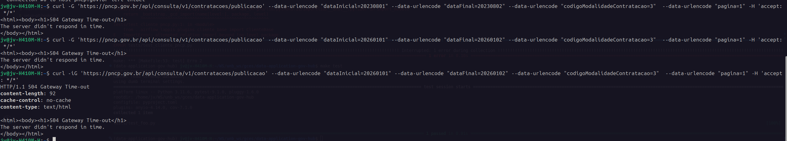

# Diário de Bordo – João Vitor Lopes Ribeiro

**Disciplina:** Gerência de Configuração e Evolução de Software (GCES)

**Equipe:** Gov Hub BR

**Comunidade/Projeto de Software Livre:** Gov Hub BR

---

## Sprint 0

### Resumo da Sprint

Essa sprint foi destinada ao entendimento e ambientação do projeto. Os esforços dessa etapa foram destinados ao estudo da documentação do GovHubBR, com o intuito de compreender o objetivo do projeto e sua arquitetura, bem como subir o ambiente de execução da solução localmente.

### Atividades Realizadas

| Data  | Atividade | Tipo (Código/Doc/Discussão/Outro) | Link/Referência | Status |
| ----- | --------- | --------------------------------- | --------------- | ------ |
| 21/04 | Configuração inicial do ambiente | Código | – | Concluído |
| 20/04 | Leitura e estudo da documentação do projeto | Estudo | [link wiki](https://gov-hub.io/govhub/comunidade/guia-contribuicao/) | Concluído |
| 21/04 | Abertura de issue para bug em módulo X | Discussão | [link issues](https://github.com/GovHub-br/data-application-gov-hub/issues) | Em andamento |

### Maiores Avanços

* Entendi melhor o objetivo do GovHubBR.
* Entendi melhor a arquitetura do GovHubBR.
* Aprendi como contribuir ao projeto segundo às diretrizes guia de contribuição.
* Aprendi a rodar a aplicação localmente utilizando docker.

    Docker

     Airflow (List Task Instance)

    Superset

    DBT debug

    DBT run

### Maiores Dificuldades

* Incompatibilidade da versão python local com a exigida pelo projeto

### Aprendizados

* Utilização da ferramenta 'uv' para seleção de um versão python.
* Melhor compreensão do projeto.
* Fluxo de contribuição do projeto.

### Plano Pessoal para a Próxima Sprint

* [ ] Identificar Issue para contribuir.
* [ ] Contribuir com pelo menos 1 PR.
* [ ] Participar da revisão de código de um colega.

## Sprint 1

Durante a Sprint 1, o foco principal foi a busca por identificar issues nos repositórios do projeto e contribuir com ao menos um pull request.  

### Atividades Realizadas

| Data  | Atividade | Tipo (Código/Doc/Discussão/Outro) | Link/Referência | Status |
| ----- | --------- | --------------------------------- | --------------- | ------ |
| 21/04 - 04/05 | Busca por issues para contruibuir | Discussão | [Issues abertas disponíveis a contribuição](https://github.com/GovHub-br/data-application-gov-hub/issues?q=is%3Aissue%20state%3Aopen%20label%3AOSS) | Concluído |
| 13/04 | Definição da escolha e estudo de issue para resolução | Estudo | [Comentário na issue](https://github.com/GovHub-br/data-application-gov-hub/issues/121#issuecomment-4444620055) | Concluído |

### Maiores avanços

* Estudo da issue [Extração - Unidades de Conservação](https://github.com/GovHub-br/data-application-gov-hub/issues/121) para contribuição me permitiu entender o funcionamento dos DAG's utilizados no projeto e estratégias de extrações de dados de arquivos *.xlsx*.

### Maiores dificuldades

* Falta de issues para contribuição
  * A issue estudada para contruibuição já havia sido escolhida por uma dupla no grupo, como isso não estava visível no repositório acabei por investir tempo para seu estudo/resolução que não foi até então aproveitado.

### Aprendizados

* Funcionamento dos DAG's na ingestão de dados
* Estratégias de extrações de dados de arquivos *.xlsx*

### Plano Pessoal para a Próxima Sprint

* [x] Identificar Issue para contribuir.
* [x] Contribuir com pelo menos 1 PR.

## Sprint 2

### Resumo da Sprint

Durante a Sprint 2, o foco principal foi novamente a busca por identificar issues nos repositórios do projeto e contribuir com ao menos um pull request. Nela foi implementado um workflow para auto-atribuição de issues utilizando GitHub Actions com o intuito de facilitar o fluxo de contribuição no projeto..

### Atividades Realizadas

| Data  | Atividade | Tipo (Código/Doc/Discussão/Outro) | Link/Referência | Status |
| ----- | --------- | --------------------------------- | --------------- | ------ |
| 22/05 | Escolha da Issue | Discussão | [Comentário na issue](https://github.com/GovHub-br/data-application-gov-hub/issues/292#issuecomment-4519763868) | Concluído |
| 25/05 | Desenvolvimento da solução a issue | Código | [Commit](https://github.com/Joa0V/data-application-gov-hub/commit/86076bf70bb346f3ccec9a33788c0f1515c3e1af) | Conclído |
| 25/05 | Abertura do pull request | Código/Doc | [Pull Request](https://github.com/GovHub-br/data-application-gov-hub/pull/327) | Concluído, aguardando review |

### Maiores Avanços

* Primeira contribuição prática para o projeto.
* Maior familiaridade com o fluxo de contribuição open source do projeto.

### Principais contribuições

* Implementação de um workflow para auto-atribuição de issues nos repositórios do projeto
  * Ativado apenas em comentários em issues, excluíndo comentários em PR's
  * Parsing de comandos ('/take' e '/issue')
  * Validação baseadas nas permissões no repositório

### Maiores dificuldades

* Entender as limitações e comportamentos do GitHub Actions em repositórios de teste.
  * Os testes do workflow tiveram de ser realizados em um repositório diferente do projeto principal. Dessa forma, os testes cobriram principalmente a lógica implementada, mas não toda a execução no ambiente final do projeto.

### Aprendizados

* Funcionamento básico do github actions.
* Estruturação de workflows automatizados
* Validação de permissões e labels em automações do GitHub.

### Plano Pessoal para a Próxima Sprint

* [X] Acompanhar andamento do PR aberto e aplicar possíveis ajustes solicitados durante o review..
* [X] Identificar Issue para contribuir.
* [ ] Contribuir com pelo menos 1 PR.

## Sprint 3

### Resumo da Sprint

A sprint 3 foi dedicada ao desenvolvimento do trabalho individual da disciplina e ao planejamento da contribuição para o projeto do GovHub. O principal esforço concentrou-se na implementação da infraestrutura de desenvolvimento e integração contínua do projeto, incluindo containerização, automação de testes, análise de segurança e qualidade de código. Paralelamente, foi realizado o levantamento e estudo das issues disponíveis no repositório do GovHub, além do acompanhamento do pull request aberto anteriormente.

### Atividades Realizadas

| Data | Atividade | Tipo (Código/Doc/Discussão/Outro) | Link/Referência | Status |
| ----- | --------- | --------------------------------- | --------------- | ------ |
| 03/06-05/06 | Estudo das issues para contribuição | Estudo | [Issues Abertas](https://github.com/GovHub-br/data-application-gov-hub/issues) | Concluído |
| 06/06 - 07/06 | Início do trabalho Individual | Código | [GitLab](https://gitlab.com/unb-esw/gces/gces2026-1/trabalho-final-gces-joao-ribeiro/-/commits/main) | Concluído |
| 26/05 - 23/06 | Monitoramento do pull request | Discussão | [Pull Request](https://github.com/GovHub-br/data-application-gov-hub/pull/327) | Concluído |

### Maiores Avanços

* Avanço no trabalho individual:
  * Atualização das dependências legadas do projeto
  * Fases 1-7
* Estudo das issues para contribuição

### Principais contribuições

* Trabalho individual:
  * Modernização do projeto-base por meio da atualização de dependências obsoletas (Express, Socket.IO e demais bibliotecas), apoiada por testes unitários para garantir a preservação do comportamento da aplicação.
  * Desenvolvimento de um ambiente de desenvolvimento containerizado utilizando Docker e Docker Compose, incluindo persistência em PostgreSQL.
  * Construção de um pipeline de CI no GitLab contemplando:
    * etapas de build e lint automatizadas;
    * execução de testes unitários;
    * testes de fuzzing para validação da robustez das entradas da aplicação;
    * integração de ferramentas de análise estática de segurança (SAST e SCA);
    * integração com SonarCloud para monitoramento da qualidade do código e cobertura de testes.

### Maiores dificuldades

* Configuração da integração com o SonarCloud, principalmente devido a problemas relacionados à configuração do projeto, gatilhos do pipeline e parâmetros de autenticação.
* Quantidade de issues abertas talvez não fossem suficientes para mais de uma contribuição futura, algumas issues abertas dizem respeito a arquivos que não existem.

### Aprendizados

* Estruturação de pipelines completos de Integração Contínua utilizando GitLab CI.
* Aplicação prática de testes de fuzzing como estratégia para aumentar a robustez do software.
* Utilização de ferramentas DevSecOps, incluindo SAST, SCA e SonarCloud, para análise automatizada de segurança e qualidade.
* Importância da modernização de dependências em projetos legados para facilitar a automação, manutenção e evolução do software, bem como a de testes automatizados nesse processo.

### Plano Pessoal para a Próxima Sprint

* [X] Finalizar Trabalho Individual
* [X] Escolher issue para contribuir
* [X] Abrir um PR

## Sprint 4

### Resumo da Sprint

A sprint 4 teve como foco a finalização do trabalho individual, e contribuir para o GovHub com ao menos um pull request. O projeto individual foi finalizado com as etapas de infraestrutura de produção e deploy contínuo do projeto individual, além do desenvolvimento e submissão de um pull request para o GovHub, contendo testes unitários e correções de inconsistências identificadas durante sua implementação.

### Atividades Realizadas

| Data | Atividade | Tipo (Código/Doc/Discussão/Outro) | Link/Referência | Status |
| ----- | --------- | --------------------------------- | --------------- | ------ |
| 08/06 | Escolha da issue para contribuição | Discussão | [Issue escolhida](https://github.com/GovHub-br/data-application-gov-hub/issues/305?issue=GovHub-br%7Cdata-application-gov-hub%7C316) | Concluído |
| 09/06-13/06 | Finalização do trabalho individual | Código | [GitLab](https://gitlab.com/unb-esw/gces/gces2026-1/trabalho-final-gces-joao-ribeiro/-/commits/main) | Concluído |
| 23/06-25/06 | Desnvolvimento da solução da issue | Código | [Commits](https://github.com/GovHub-br/data-application-gov-hub/pull/404/commits) | Concluído |
| 23/06 | Abertura do pull request | Código / Doc | [Pull request](https://github.com/GovHub-br/data-application-gov-hub/pull/404) | Concluído |
| 23/06-30/06 | Monitoramento dos pull requests | Discussão | [Pull request 1](https://github.com/GovHub-br/data-application-gov-hub/pull/327), [Pull request 2](https://github.com/GovHub-br/data-application-gov-hub/pull/404) | Concluído |

### Maiores Avanços

* Finalização do trabalho individual (Fases 8-10)
* Implementação da solução de uma issue e abertura de pull request contendo novos testes unitários e correções de comportamento identificadas.

### Principais contribuições

* Adição de testes ao cliente pncp (`cliente_pncp.py`), utilizando mocks para simular respostas da API do PNCP ao GovHub:
  * Testes para o métodos utilizados para para buscar publicações de contratações no PNCP e armazenar no PostgreSQL;
  * Testes para método utilizado para buscar itens e resultados das contratações no PNCP;
  * Correção da assinatura do método `get_contratacoes_publicacao()`, tornando obrigatório o parâmetro `codigo_modalidade_contratacao`, conforme especificado na documentação oficial da API do PNCP;
  * correção da lógica de paginação em `get_contratacoes_publicacao_paginado()`, que desconsiderava o parâmetro `max_paginas` informado.
  * Submissão do pull request contendo tanto os testes quanto as correções identificadas.
* Ao projeto individual:
  * Implementação de Dockerfiles otimizados para produção utilizando multi-stage builds;
  * Configuração do Nginx para servir a aplicação em ambiente de produção;
  * Criação dos manifestos Kubernetes para orquestração da aplicação.
  * Configuração do pipeline de Deploy Contínuo (CD), incluindo publicação automática das imagens de container.
  * Configuração de HTTPS utilizando Cert-Manager e integração com Ingress no Kubernetes.

### Maiores dificuldades

* Documentação da API do PNCP apresentava inconsistências: enquanto alguns endpoints estavam bem documentados, outros possuíam documentação incompleta ou inexistente, exigindo análise do código-fonte e experimentação para compreender seu funcionamento.
* Indisponibilidade temporária da API: os momentos de estudo dos retornos da api foram comprometidos por ela estar indisponível o que dificultou a validação dos retornos esperados e o desenvolvimento dos testes unitários.

* Configuração do ambiente Kubernetes, especialmente durante a validação automática dos manifestos e da integração com Cert-Manager.
* Os pull requests submetidos não receberam revisões durante o período da sprint, limitando o ciclo de feedback sobre as contribuições realizadas.

### Aprendizados

* Configuração de ambientes de produção utilizando Docker, Nginx e multi-stage builds.
* Orquestração de aplicações com Kubernetes, incluindo Deployments, ConfigMaps, Secrets e Ingress.
* Implementação de pipelines de Deploy Contínuo com publicação automática de imagens de container.
* Configuração de HTTPS utilizando Cert-Manager em ambientes Kubernetes.
* Importância dos testes automatizados para revelar inconsistências de implementação que não estavam explicitamente descritas nas issues, permitindo que a contribuição agregasse valor além da cobertura de testes.
