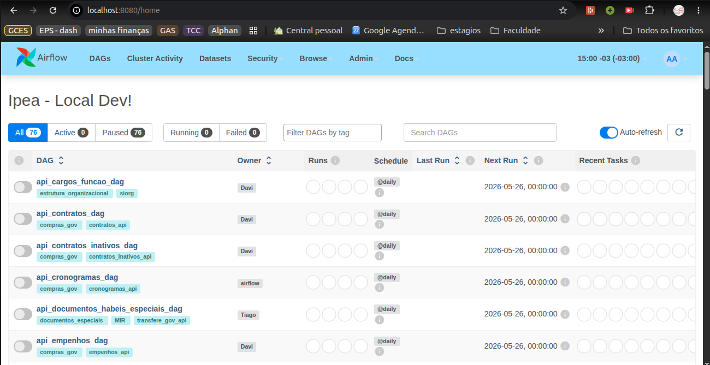
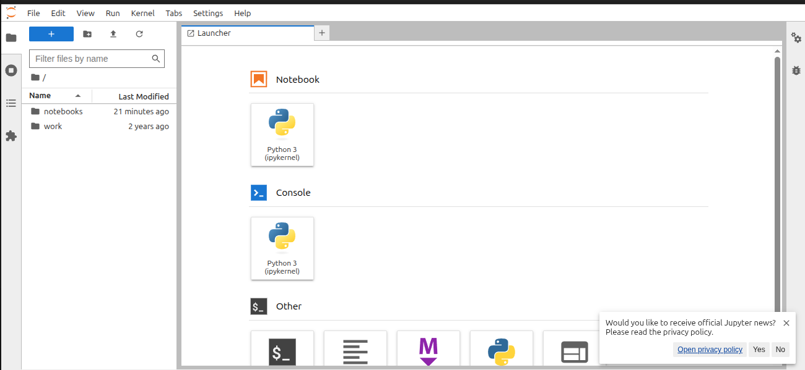
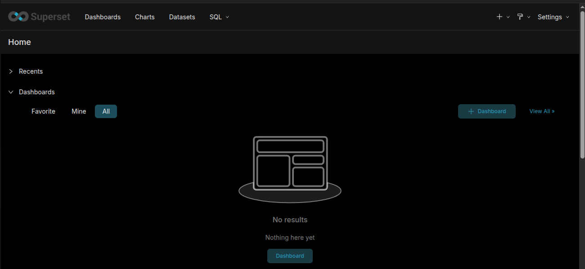

# Diário de Bordo – Luciano de Freitas Melo

**Matrícula:** 202016847  

**Disciplina:** Gerência de Configuração e Evolução de Software (GCES)  

**Equipe:** Gov Hub BR **  

**Projeto:** Gov Hub BR **   

> ** Antes fazia parte do projeto KDE Frameworks e migrei para esse na sprint 2

---

## Sprint 0 – [06/04/2026 – 20/04/2026]

### Resumo da Sprint

Dediquei esta sprint a preparar o terreno para as contribuições ao KDE. Além de integrar as plataformas de desenvolvimento (KDE Invent e Matrix), dediquei tempo para entender o funcionamento dos repositórios e da comunidade.

Estudei a arquitetura organizada em tiers, o que me deu uma visão clara de como o KDE garante estabilidade e modularidade. Também pesquisei sobre inovações recentes, como o projeto de Language Bindings, que promete facilitar a distribuição de frameworks via Pip.

### Atividades Realizadas

| Data   | Atividade                                            | Tipo (Código/Doc/Discussão/Outro) | Link/Referência         | Status    |
| ------ | ---------------------------------------------------- | --------------------------------- | ----------------------- | --------- |
| 06/04  | Leitura do guia de contribuição do KDE              | Estudo                            | [Get Involved](https://community.kde.org/Get_Involved)      | Concluído |
| 08/04  | Leitura e compreensão do código de conduta          | Estudo                            | [KDE Code of Conduct](https://kde.org/code-of-conduct/)     | Concluído |
| 10/04  | Criação de conta no KDE Invent                      | Configuração                      | [invent.kde.org](https://invent.kde.org)          | Concluído |
| 12/04  | Criação de conta no Matrix                          | Configuração                      | [matrix.org](https://matrix.org)              | Concluído |
| 15/04  | Exploração inicial da estrutura de subprojetos      | Estudo                            | [KDE Development Docs](https://develop.kde.org/docs/) e [KDE Frameworks](https://api.kde.org/)  | Concluído |
| 18/04  | Estudo do projeto Language Bindings                 | Estudo                            | [Ship Frameworks via Pip](https://community.kde.org/Development/Language_Bindings/Ship_Frameworks_via_Pip) | Concluído |

### Maiores Avanços

* Contas criadas nas plataformas da comunidade (Invent e Matrix).
* Entendimento dos processos de comunicação e estrutura dos repositórios (tiers).

### Maiores Dificuldades

* Dificuldade de compreender como contribuir nos projetos e onde encontrar issues para resolver nos repositórios.

### Aprendizados

* Fluxo de contribuição e código de conduta da comunidade KDE.
* Entendimento da estrutura dos repositórios.

### Plano Pessoal para a Próxima Sprint

* [ ] Contribuir com pelo menos 1 PR.
* [ ] Participar da revisão de código de um colega.

---

## Sprint 1 – [21/04/2026 – 04/05/2026]

### Resumo da Sprint

> Sem contribuições nessa sprint

### Plano Pessoal para a Próxima Sprint

* [ ] Entendimento do projeto Gov Hub BR
* [ ] Iniciar contribuição no projeto Gov Hub BR

---

## Sprint 2 – [05/05/2026 – 24/05/2026]

### Resumo da Sprint

Durante esta sprint, concluí a etapa de integração ao projeto, que incluiu a leitura da documentação técnica e o alinhamento com o fluxo de contribuição. Além disso, realizei a configuração do ambiente de desenvolvimento local e finalizeia entrega da minha primeira issue.

### Atividades Realizadas

| Data  | Atividade                                   | Tipo (Código/Doc/Discussão/Outro) | Link/Referência | Status    |
| ----- | ------------------------------------------- | --------------------------------- | --------------- | --------- |
| 18/05 | Leitura e estudo da documentação do projeto **Data Pipeline**            | Doc                            | [link da wiki](https://gov-hub.io/govhub/documentacao/instalacao/) | Concluído |
| 19/05 | Execução local do projeto **Data Pipeline** | Código                            | *comprovação via imagem*    | Concluído |
| 22/05 | Estudo sobre códigos de conduta para comunidades de Software Livre      | Estudo                         | https://opensource.guide/pt/code-of-conduct/   | Concluído |
| 22/05 | Criação do código de conduta do projeto **Data Pipeline**      | Código                         | [Issue #277](https://github.com/GovHub-br/data-application-gov-hub/issues/277) [Pull Request](https://github.com/GovHub-br/data-application-gov-hub/pull/322)  | Concluído |

### Comprovações por Imagem

> Execução Local do Airflow

> Execução Local do Jupyter

> Execução Local do Superset

### Maiores Avanços

* Execução local do projeto;
* Criação do Código de Conduta

### Maiores Dificuldades

* Tempo para entendimento e execução do projeto para conseguir contribuir em issues mais complexas.

### Aprendizados

* Melhores práticas para criação de códigos de conduta relevantes.

### Plano Pessoal para a Próxima Sprint

* [ ] Contrubuir em 2 issues de teste unitário
* [ ] Participar da revisão de código de um colega.

---
    
## Sprint 3 – [25/05/2026 – 08/06/2026]

### Resumo da Sprint

Nesta sprint, iniciei os trabalhos práticos no código do Gov Hub BR assumindo a **Issue #313**, que solicitava a criação de testes unitários para o script `airflow_lappis/plugins/cliente_ibge.py`. Dediquei a maior parte do tempo para entender a arquitetura do arquivo, estruturar os mocks para a API de municípios/malhas do IBGE e preparar o mock do FTP. 

Durante o desenvolvimento e análise dos caminhos de execução para a cobertura de testes, acabei identificando um bug silencioso no método `obter_conteudo_arquivo`, relacionado ao uso do `.decode("latin-1")`.

### Atividades Realizadas

| Data   | Atividade                                            | Tipo (Código/Doc/Discussão/Outro) | Link/Referência         | Status    |
| ------ | ---------------------------------------------------- | --------------------------------- | ----------------------- | --------- |
| 27/05  | Estudo da arquitetura do `cliente_ibge.py` e requisitos da Issue #313 | Estudo | [Issue #313](https://github.com/GovHub-br/data-application-gov-hub/issues/313) | Concluído |
| 30/05  | Criação da estrutura base de testes e mocks (FTP e API do IBGE) | Código | Issue #313 | Concluído |
| 03/06  | Implementação dos testes de caminhos de execução e tratamento de falhas | Código | Issue #313 | Em Andamento |
| 05/06  | Investigação e análise do bug no método `obter_conteudo_arquivo` | Código/Discussão | PR #379 | Concluído |

### Maiores Avanços

* Entendimento profundo das chamadas externas (FTP/API) feitas pelo módulo do IBGE.
* Estruturação inicial dos testes e identificação da causa raiz de um bug de decodificação de arquivos.

### Maiores Dificuldades

* Garantir o tratamento seguro das falhas dos endpoints mockados e lidar com a ausência de exceção `UnicodeDecodeError` no `latin-1` ao tentar processar determinados bytes.

### Aprendizados

* Técnicas de mock de conexões FTP e APIs RESTful em Python.
* Particularidades da tabela de codificação `latin-1` (que aceita qualquer byte sem gerar erro), o que mascarava falhas de decodificação no projeto.

### Plano Pessoal para a Próxima Sprint

* [ ] Corrigir o bug de decodificação.
* [ ] Finalizar a cobertura de testes da classe, visando 100%.
* [ ] Abrir o Pull Request e acompanhar o Code Review.

---

## Sprint 4 – [09/06/2026 – 23/06/2026]

### Resumo da Sprint

Dediquei esta sprint à finalização da **Issue #313**. Primeiro, apliquei a correção para o bug de decodificação no `obter_conteudo_arquivo`, forçando o sistema a tentar decodificar com `utf-8` e `cp1252` antes de fazer o fallback para o `latin-1`. 

Em seguida, finalizei a escrita dos testes, garantindo que todos os caminhos de execução e de exceção estivessem devidamente validados. Após rodar os comandos de validação (`make lint` e `make test`), alcancei a marca de **100% de cobertura de testes** no arquivo. Abri o **PR #379**, que passou pela revisão do colega Davi Aguiar Vieira e foi integrado (*merged*) com sucesso à branch principal.

### Atividades Realizadas

| Data   | Atividade                                            | Tipo (Código/Doc/Discussão/Outro) | Link/Referência         | Status    |
| ------ | ---------------------------------------------------- | --------------------------------- | ----------------------- | --------- |
| 10/06  | Implementação da correção do bug de encoding (`utf-8` -> `cp1252` -> `latin-1`) | Código | [PR #379](https://github.com/GovHub-br/data-application-gov-hub/pull/379) | Concluído |
| 12/06  | Conclusão dos testes de exceção dos métodos da classe | Código | PR #379 | Concluído |
| 15/06  | Validação local do projeto (`make lint` e `make test`) e ajustes finais | Código | PR #379 | Concluído |
| 17/06  | Abertura do Pull Request com as evidências de cobertura (100%) | Discussão/Código | [PR #379](https://github.com/GovHub-br/data-application-gov-hub/pull/379) | Concluído |

### Maiores Avanços

* Conclusão da minha primeira grande contribuição técnica (Issue #313 fechada).
* Cobertura total (100%) alcançada no arquivo `cliente_ibge.py`
* PR #379 revisado e mergeado na `main`.

### Maiores Dificuldades

* Ao rodar o `make lint` localmente para o projeto todo, acabei encontrando vários erros que apontavam para arquivos que eu não havia editado, o que exigiu atenção para isolar apenas o escopo da minha issue.

### Aprendizados

* Fluxo de CI/CD e revisão de código em PRs reais.
* Importância de testar as ferramentas de linting no escopo correto para não poluir o commit com formatações de terceiros.

### Plano Pessoal para a Próxima Sprint

* [ ] Assumir uma nova Issue de desenvolvimento de feature ou pipeline.
* [ ] Auxiliar na revisão de código (Code Review) de pelo menos um colega da equipe.